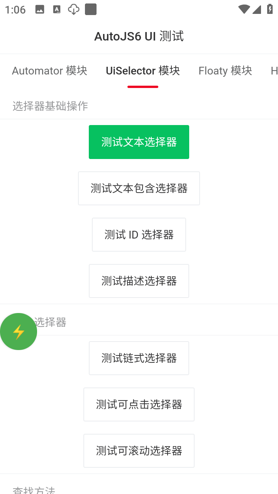

# Simple AutoJS UI

一个基于 AutoJS6 的现代化 UI 框架项目，使用 WebView + Vue.js 构建美观易用的移动端界面。

## 项目简介

Simple AutoJS UI 是一个为 AutoJS6 设计的 UI 开发框架，它通过 WebView 和 Vue.js 提供了一种更加现代化、易于开发的界面构建方式。项目采用模块化架构，将 AutoJS6 的各项功能封装为独立模块，通过 jsBridge 实现 Web 端与原生 AutoJS API 的无缝交互。

## 主要特性

- **现代化 UI**：使用 Vue.js 2.6 + Vant UI 2.12 构建，提供美观的移动端交互体验
- **模块化架构**：将 AutoJS6 功能封装为独立模块，便于维护和扩展
- **统一注册机制**：通过模块注册器统一管理所有模块的 jsBridge handlers
- **悬浮窗管理**：内置悬浮窗管理器，支持脚本控制和状态显示
- **完整的 API 封装**：涵盖 AutoJS6 的主要功能模块
- **开发友好**：提供测试界面，便于快速调试各个模块功能

## 界面预览

<div align="center">
  
  
  
  
</div>

## 快速开始

### 前置要求

- [AutoJS6](https://github.com/SuperMonster003/AutoJs6) 应用（6.3版本及以上）
- VSCode 开发工具
- AutoJS6 VSCode 插件

### 安装步骤

1. 克隆或下载本项目到本地
2. 在 VSCode 中打开项目
3. 确保手机和电脑在同一局域网
4. 在 AutoJS6 应用中开启 VSCode 服务器
5. 在 VSCode 中连接到手机，运行 `main.js`

## 使用示例

### Web 端调用模块

项目通过 `modules/init.js` 自动加载所有模块，在 Vue 组件中可以直接使用 `autojs` 全局对象调用各模块功能。

#### 全局函数模块

```javascript
// 显示 Toast 消息
autojs.global.toast('Hello AutoJS6!');

// 显示 Toast 并打印日志
autojs.global.toastLog('这是一条日志消息');

// 延迟执行
await autojs.global.sleep(2000); // 暂停 2 秒

// 生成随机数
const random1 = await autojs.global.random(); // 0-1 之间的随机数
const random2 = await autojs.global.random(1, 100); // 1-100 之间的随机整数

// 获取当前应用信息
const pkg = await autojs.global.currentPackage();
const activity = await autojs.global.currentActivity();

// 剪贴板操作
await autojs.global.setClip('要复制的内容');
const clipContent = await autojs.global.getClip();
```

#### HTTP 模块

```javascript
// GET 请求
const response = await autojs.http.get('https://api.github.com/zen');
if (response.statusCode === 200) {
    console.log('响应内容:', response.body);
}

// 带请求头的 GET 请求
const response2 = await autojs.http.get('https://api.example.com/data', {
    headers: {
        'User-Agent': 'AutoJS6/1.0',
        'Authorization': 'Bearer token'
    }
});

// POST 表单请求
const response3 = await autojs.http.post('https://api.example.com/login', {
    username: 'user',
    password: 'pass'
});

// POST JSON 请求
const response4 = await autojs.http.postJson('https://api.example.com/data', {
    name: 'AutoJS6',
    version: '6.0.0',
    features: ['自动化', 'WebView']
});

// 响应对象包含：
// - statusCode: 状态码
// - statusMessage: 状态消息
// - body: 响应体字符串
// - bodyJson: 自动解析的 JSON 对象
// - contentType: Content-Type
```

#### 自动化操作模块

```javascript
// 点击坐标
await autojs.automator.click(100, 200);

// 长按
await autojs.automator.longClick(100, 200);

// 滑动
await autojs.automator.swipe(100, 500, 100, 200, 300); // 从(100,500)滑动到(100,200)，耗时300ms

// 输入文本
await autojs.automator.input('Hello World');

// 按键操作
await autojs.automator.back(); // 返回键
await autojs.automator.home(); // Home键
```

#### 悬浮窗模块

支持通过 WebView 创建 HTML 和 Vue 页面作为悬浮窗：

```javascript
// HTML 悬浮窗
const htmlWindow = await autojs.floaty.window(htmlContent, {
    type: 'html',
    width: '350',
    height: '500'
});

// Vue 悬浮窗
const vueWindow = await autojs.floaty.window(vueTemplate, {
    type: 'vue',
    vueScript: vueScript,
    width: '300',
    height: '400'
});

// URL 悬浮窗
const urlWindow = await autojs.floaty.window('https://example.com', {
    url: 'https://example.com',
    width: '400',
    height: '600'
});

// 控制悬浮窗
await htmlWindow.setPosition(100, 100);
await htmlWindow.setSize(400, 300);
await htmlWindow.setAdjustEnabled(false);
await htmlWindow.close();
await autojs.floaty.closeAll();
```

详细说明请参考 [Floaty 使用指南](docs/FLOATY_USAGE.md)

#### 设备信息模块

```javascript
// 获取设备信息
const imei = await autojs.device.getIMEI();
const androidId = await autojs.device.getAndroidId();
const model = await autojs.device.getDeviceModel();
const brand = await autojs.device.getBrand();

// 屏幕信息
const width = await autojs.device.getScreenWidth();
const height = await autojs.device.getScreenHeight();
const density = await autojs.device.getScreenDensity();

// 系统版本
const sdkInt = await autojs.device.getSdkInt();
const release = await autojs.device.getRelease();
```

#### 文件操作模块

```javascript
// 读取文件
const content = await autojs.files.read('/sdcard/test.txt');

// 写入文件
await autojs.files.write('/sdcard/test.txt', 'Hello AutoJS6');

// 判断文件是否存在
const exists = await autojs.files.exists('/sdcard/test.txt');

// 创建目录
await autojs.files.ensureDir('/sdcard/myapp/data');

// 列出目录内容
const files = await autojs.files.listDir('/sdcard/');
```

#### 本地存储模块

```javascript
// 保存数据
await autojs.storages.put('username', 'testuser');
await autojs.storages.put('config', { theme: 'dark', fontSize: 14 });

// 读取数据
const username = await autojs.storages.get('username');
const config = await autojs.storages.get('config');

// 删除数据
await autojs.storages.remove('username');

// 清空所有数据
await autojs.storages.clear();
```

#### Base64 模块

```javascript
// Base64 编码
const encoded = await autojs.base64.encode('Hello AutoJS6');

// Base64 解码
const decoded = await autojs.base64.decode(encoded);
```

### 完整示例

以下是一个完整的 Vue 组件示例：

```vue
<template>
    <div>
        <van-button @click="testHttpRequest">测试 HTTP 请求</van-button>
        <van-button @click="testAutomation">测试自动化操作</van-button>
    </div>
</template>

<script>
export default {
    methods: {
        // HTTP 请求示例
        async testHttpRequest() {
            try {
                autojs.global.toastLog('正在请求 API...');
                
                const response = await autojs.http.get('https://api.github.com/zen');
                
                if (response.statusCode === 200) {
                    autojs.global.toastLog('请求成功: ' + response.body);
                } else {
                    autojs.global.toastLog('请求失败: ' + response.statusCode);
                }
            } catch (error) {
                autojs.global.toastLog('请求出错: ' + error);
            }
        },
        
        // 自动化操作示例
        async testAutomation() {
            autojs.global.toastLog('开始自动化测试...');
            
            // 获取屏幕尺寸
            const width = await autojs.device.getScreenWidth();
            const height = await autojs.device.getScreenHeight();
            
            // 点击屏幕中心
            await autojs.automator.click(width / 2, height / 2);
            await autojs.global.sleep(1000);
            
            // 返回上一页
            await autojs.automator.back();
            
            autojs.global.toastLog('自动化测试完成!');
        }
    }
};
</script>
```

## 模块架构说明

### 通信流程

1. **Web 端模块** (`web/modules/*.js`) - 封装 jsBridge 调用，提供 Promise 接口
2. **jsBridge** - AutoJS6 提供的 WebView 通信桥梁
3. **原生端模块** (`modules/*.js`) - 处理 jsBridge 请求，调用 AutoJS6 API
4. **模块注册器** (`modules/register.js`) - 统一注册所有原生端模块

### 模块加载

Web 端通过 `web/modules/init.js` 自动加载所有模块：

```javascript
// init.js 会自动加载并初始化所有模块
// 最终创建 window.autojs 全局对象，包含所有模块
window.autojs = {
    global: { toast, sleep, random, ... },
    http: { get, post, postJson, ... },
    device: { getIMEI, getScreenWidth, ... },
    files: { read, write, exists, ... },
    // ... 其他模块
}
```

### 调试技巧

1. 在 VSCode 中直接运行和调试
2. 使用 `autojs.global.toastLog()` 显示日志
3. 点击界面上的"查看日志"按钮查看控制台
4. WebView 的 console.log 会自动输出到 AutoJS 控制台
5. 各模块都有独立测试界面，在主界面切换标签页测试

---

如有问题或建议，欢迎提 Issue 或 PR！

